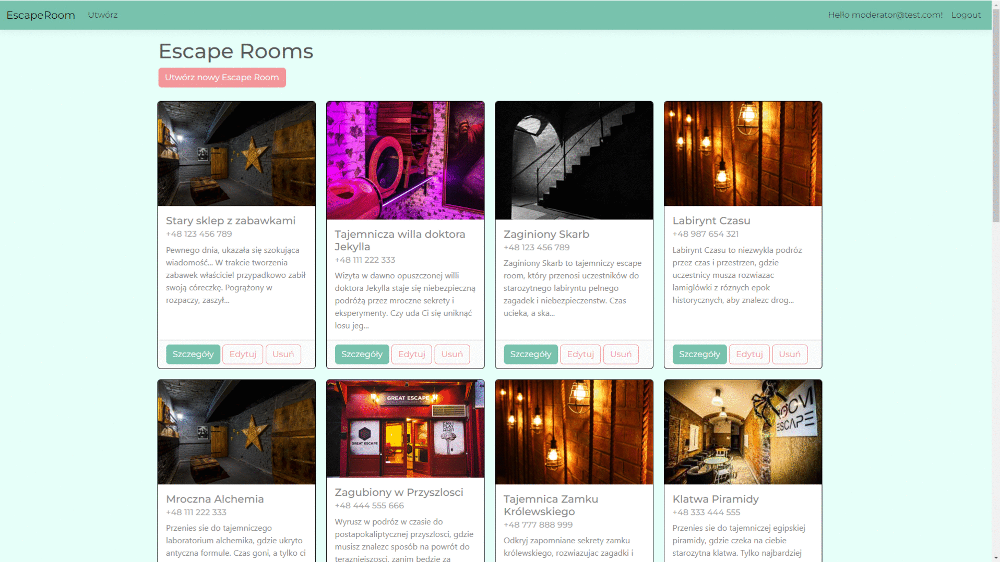
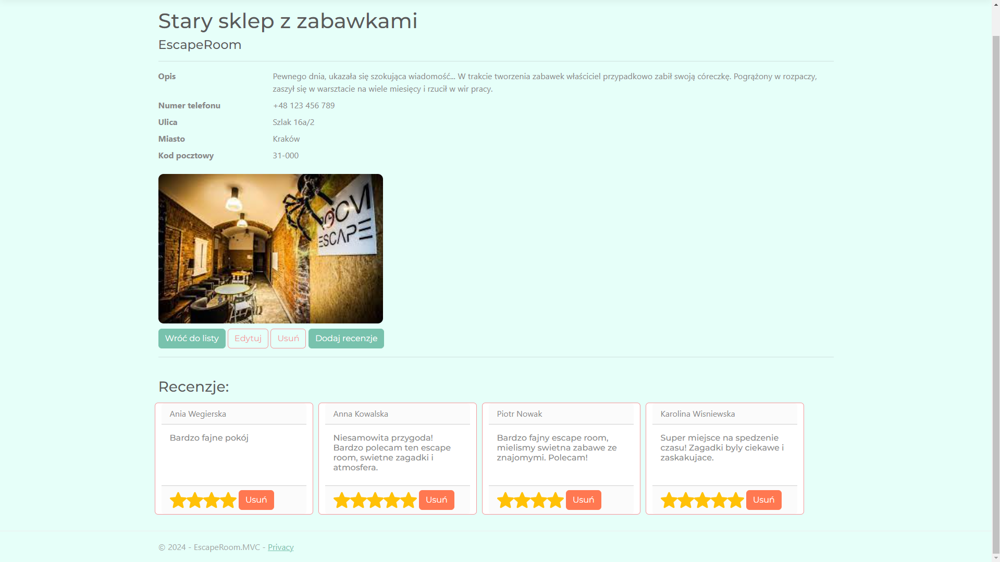
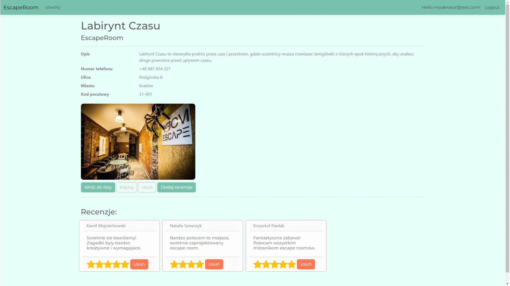
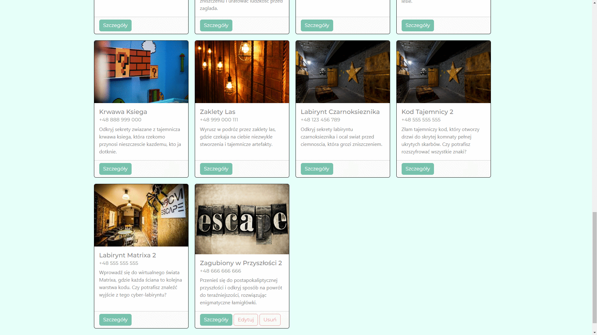
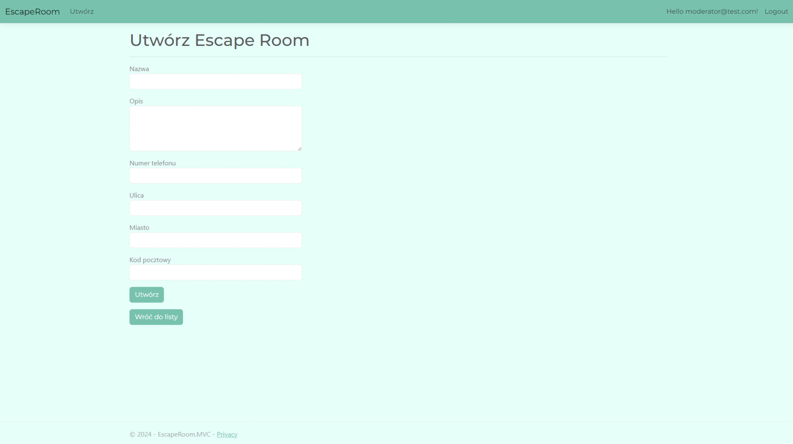
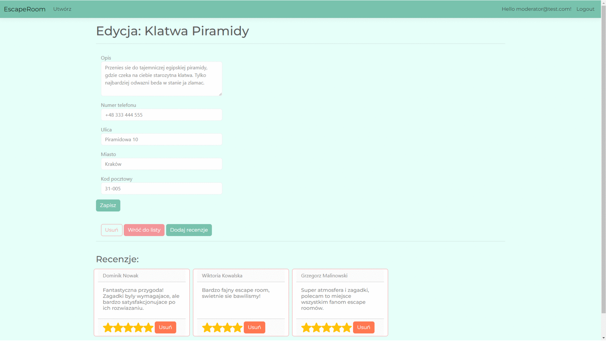
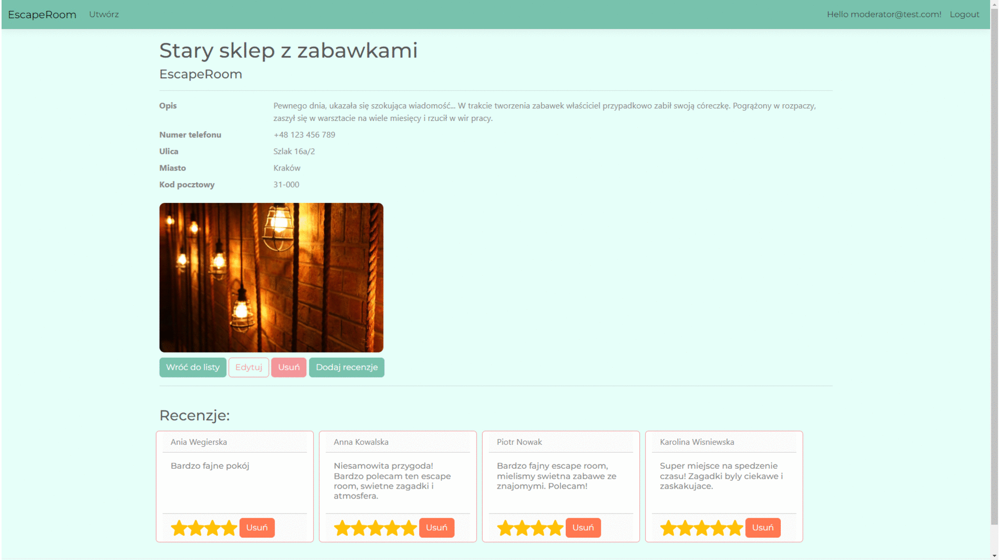
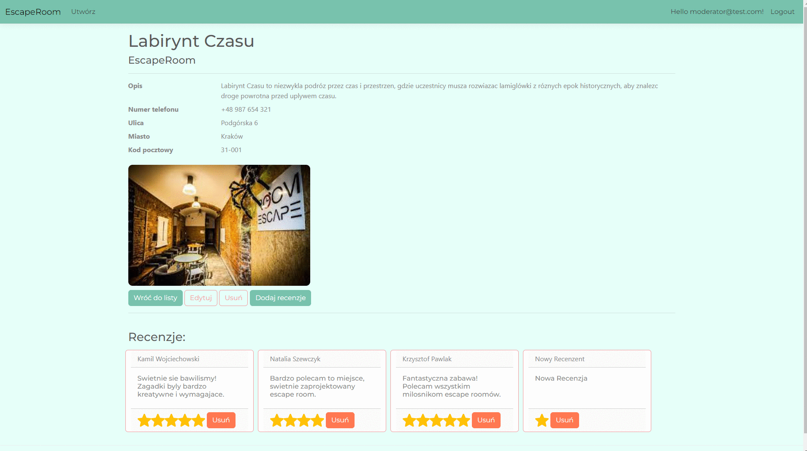

# Escape Room
## Projekt aplikacji webowej w ASP. NET MVC (model-view-controller).

# [Escape Room - Kliknij aby przetestować aplikacje.](https://escaperoom.bsite.net/)

Aplikacja służy do prezentacji i recenzowania Escape Room. Użytkownik z uprawnieniami Owner może dodawać swoje Escape Roomy, inni zwykli użytkownicy mogą je przeglądać i po wizycie ocenić, jak im się podobało dodając recenzje do pokoju, który odwiedzili. Escape Roomy oraz ich recenzje mogą usuwać i edytować jedynie ich właściciele oraz użytkownik z uprawnieniami moderatora, który czuwa nad stroną.

W przypadku gdy użytkownik nie jest uprawniony do jakiejś akcji przyciski np. edycji i usuwania nie są mu wyświetlanie, również po stronie backendu akcje są zabezpieczone i użytkownik bez uprawnień nie może ich wywołać.

Na potrzeby prezentacji na hostingu powyżej rola Owner jest zniesiona, aby każdy mógł przetestować tworzenie, edycje i usuwanie Escape Room.

Poniżej znajduje się prezentacja kilku kluczowych funkcjonalności:

## 1. Widok główny, na którym można przeglądać aktualne oferty:

## 2. Szczegóły i Recenzje:

## 3. Dodawanie Recenzji - wyskakujący formularz z walidacją:

## 4. Brak uprawnień:
Użytkownik nie ma przycisków do funkcji do których nie jest uprawniony.

## 5. Dodawanie Escape Roomu - formularz z walidacją:

## 5. Edycja Escape Roomu:

## 6. Usuwanie Escape Roomu z okienkiem potwierdzenia:

## 7. Usuwanie Recenzji:

W Projekcie użyłem między innymi:
* ASP.NET Core MVC
* C#
* Entity Framework
* ASP.NET Identity
* Baza danych MS SQL
* HTML, CSS, JavaScript
* Clean architecture
* CQRS i MediatR
* Automapper
* Toastr
* API przesyłane w formacie JSON

Aplikacja realizowana z pomocą kursu.
Zdjęcia w aplikacji webowej są generowane losowo z puli grafik, w przyszłości w ich miejsce można zaimplementować zdjęcia przesyłane z formularza.
