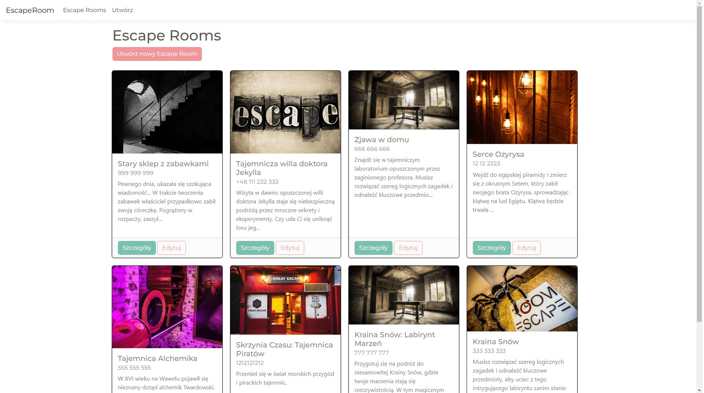
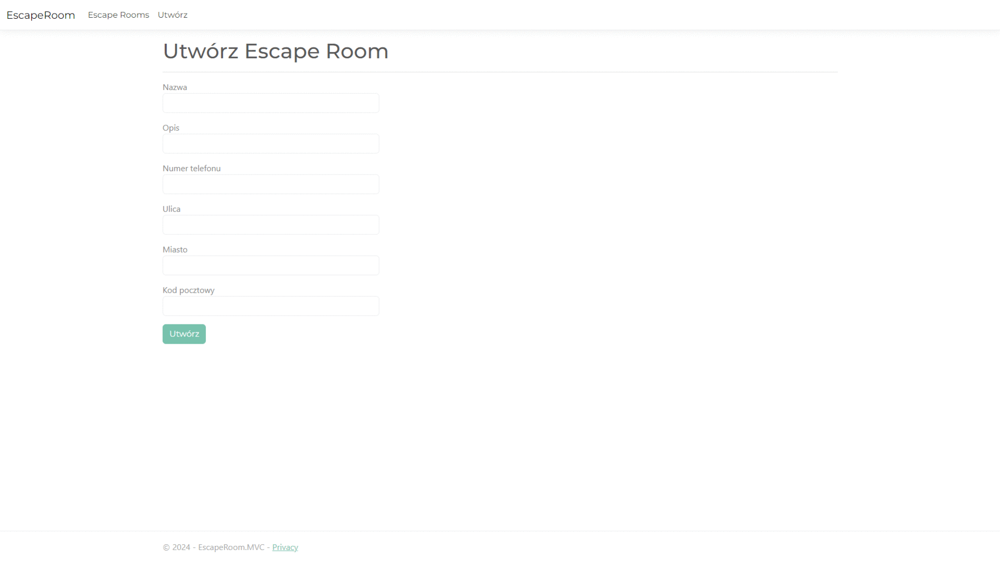
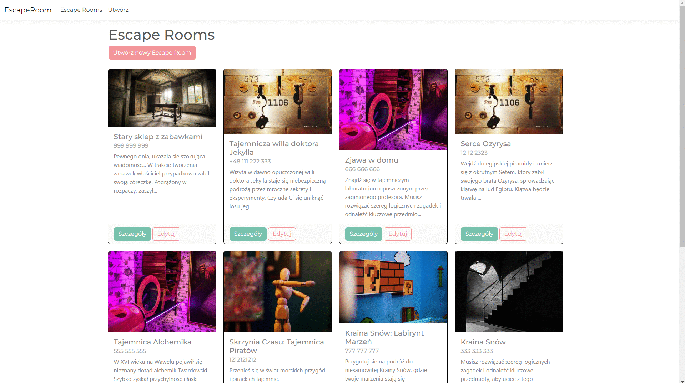
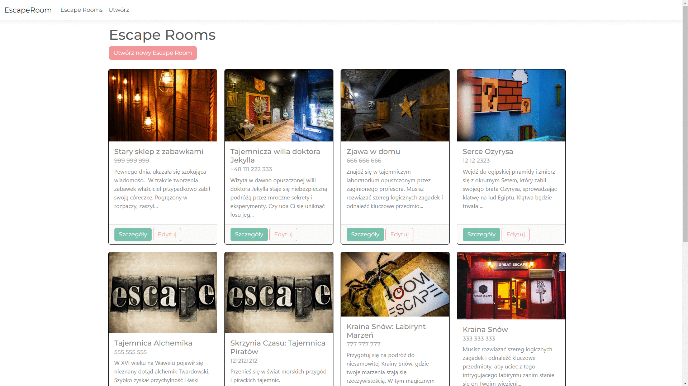

# Escape Room
### Miło mi Cię widzieć na stronie projektu mojej aplikacji webowej w ASP.NET MVC (model-view-controller).

# [DEMO - kliknij aby przetestować aplikacje.](https://krzaczobrwisty.bsite.net/)

Na początku chciałbym podkreślić, że projekt jest cały czas w fazie rozwoju i mam nadzieję z czasem dodawać tu nowe fukcje :D.

Aplikacja służy do ogłaszania ofert firm zajmujących się prowadzeniem Escape Roomów. Użytkownik za jej pomocą może dodawać, edytować, wyświetlać szczegóły i przeglądać ofertę Escape Roomów w swojej okolicy.

## 1. Widok główny na którym można przeglądać aktualne oferty:

## 2. Tworzenie Escape Room - Formularz z walidacją wpisywanych danych:

##  3. Szczegóły danego escape roomu:

## 4. Edycja Escape Room

W Projekcie użyłem między innymi:
* ASP.NET Core MVC
* Entity FrameWork
* baze danych ms sql
* clean architecture
* CQRS i MediatR
* automapper

Aplikacja realizowana z pomocą kursu i podczas kursu.
